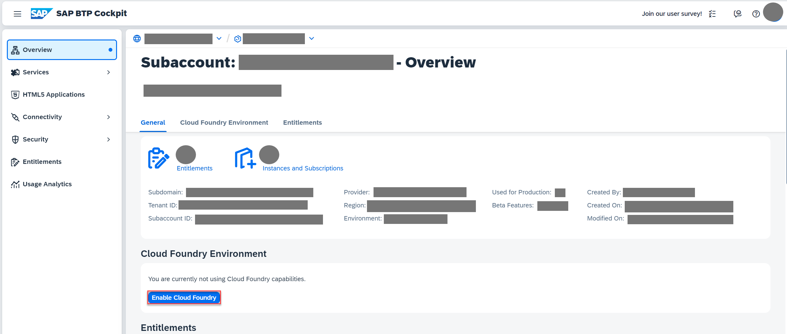
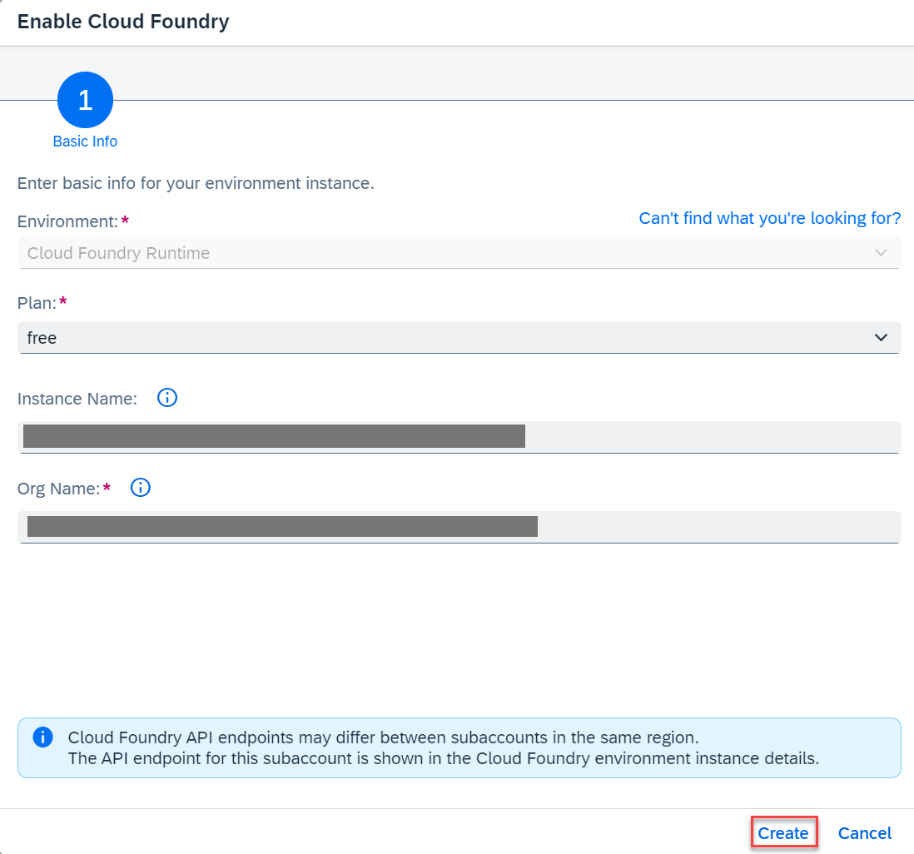
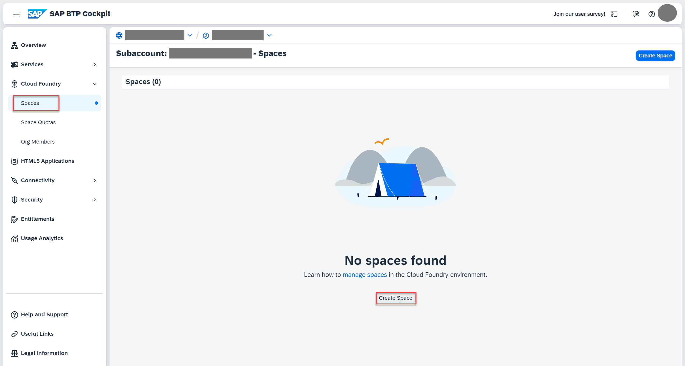
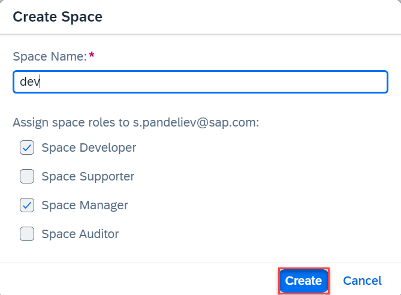

## Enable Cloud Foundry Runtime

This creates a Cloud Foundry (CF) organization (org) in your subaccount. There’s always one Cloud Foundry org per subaccount. Later on, when you log on to Cloud Foundry, it asks you which Cloud Foundry org you want to log on to. For any development in your subaccount, you need to choose this org for your subaccount. If you don’t have a CF org created in your subaccount already, follow the steps below to create it.

- 1. Navigate to your subaccount and choose Enable Cloud Foundry
     
- 2. In the Enable Cloud Foundry popup, change the values for Instance Name and Org Name as needed and choose Create.
     

     Make sure the instance name is CLI-friendly. This will make it easier to manage your instances with the SAP BTP command line interface as well.

     A CLI-friendly name is a short string (up to 32 characters) that contains only alphanumeric characters (A-Z, a-z, 0-9), periods, underscores, and hyphens. It can’t contain white spaces.

     When enabling the runtime, you’ll notice that the instance name is generated automatically for you. You can use that name or replace it with the name of your choice.

- 3. Navigate to Cloud Foundry → Spaces and choose **Create Space**.

  

- 4. Enter a space name (for example, **dev**) and choose **Create**.
     
