## Overview.

In this card, we will download the application from github repository, then onboarding the SDM repository, then deploy the application into BTP Cloud Foundry runtime in BTP Business Application Studio.

## Prerequisites:

- Your account as been assigned with role collections **Business_Application_Studio_Developer** and **Business_Application_Studio_Administrator**.
- Your account has been listed as Cloud Foundry Space Member as **Space Developer** and **Space Manager**

## Procedure

- 1. Login into Business Application Studio from BTP subaccount.

  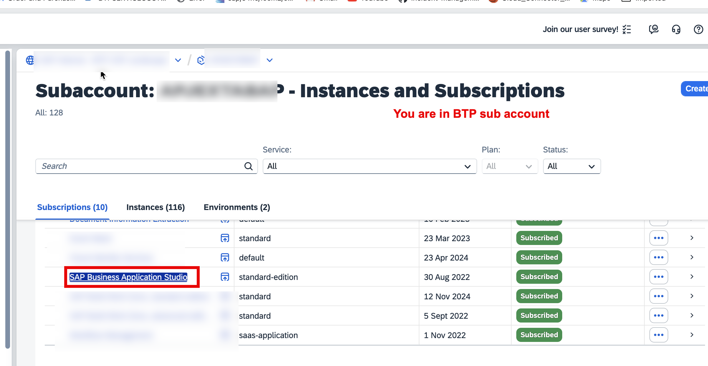

Please make sure that REST Client has been installed in BAS .

    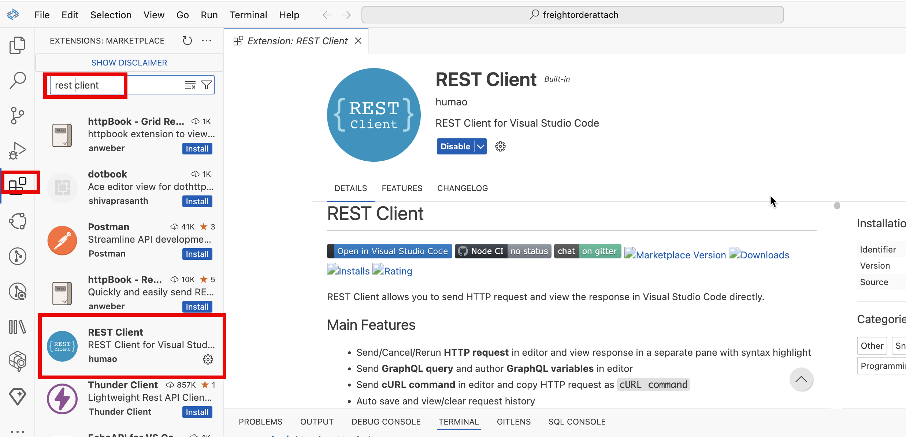

- 2. Onboarding SAP Document Management Service repository.

  Get the service key `sdm-key` content and fill the related information in the file `sdmrepositoryoboard.http`. Then click on `Send Request` under `getToken`.

  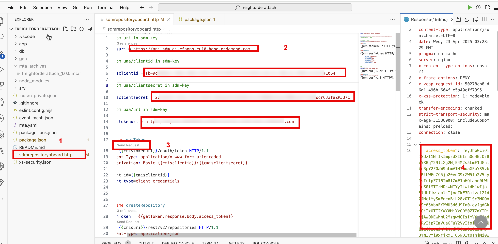

  Then click on `Send Request` under `createRepository`.

  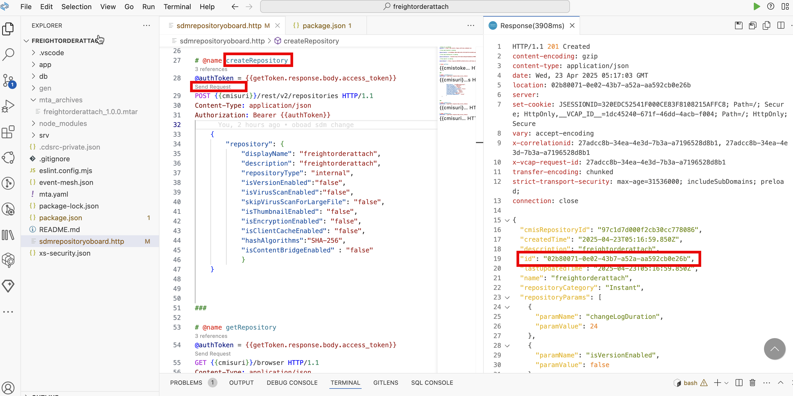

  Please note down the repository ID. In my case, it is `02b80071-0e02-43b7-a52a-aa592cb0e26b`

- 3. Update the repository ID under `cds/requires/sdm/settings/repositoryId` in the file **package.json**.
     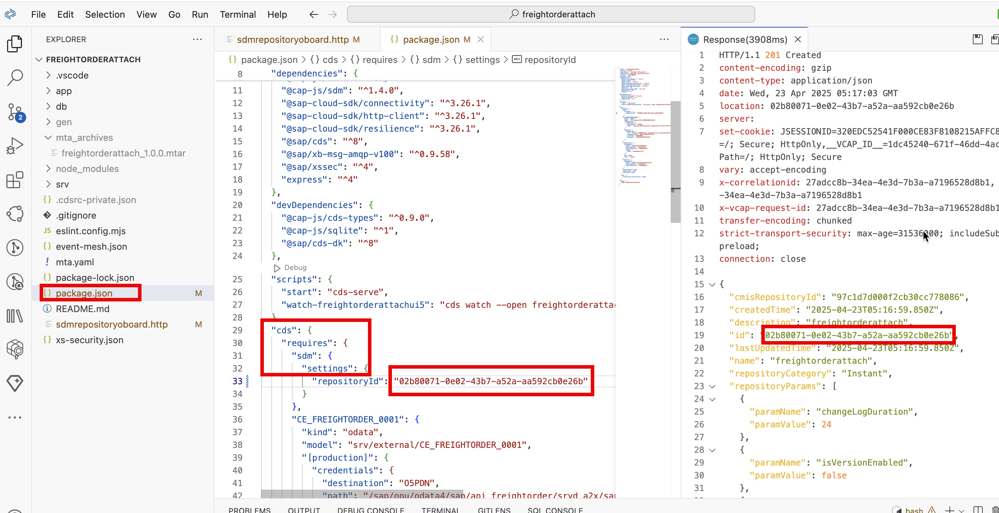

- 4. Run the following commands to build the application terminal of BAS.

  ```bash
  npm i
  mbt build
  ```

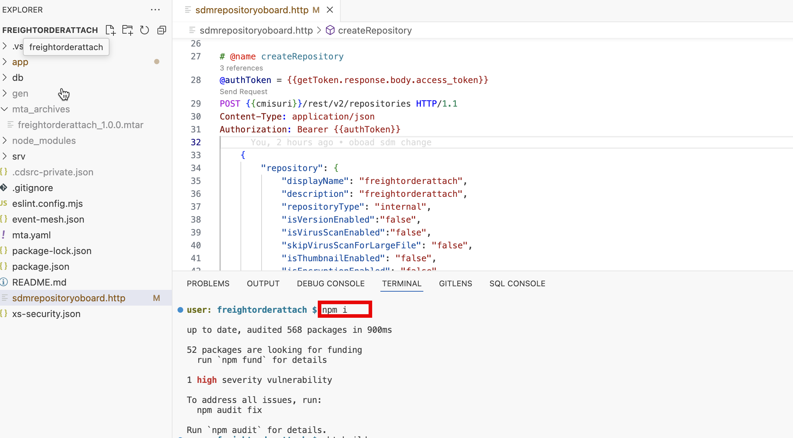
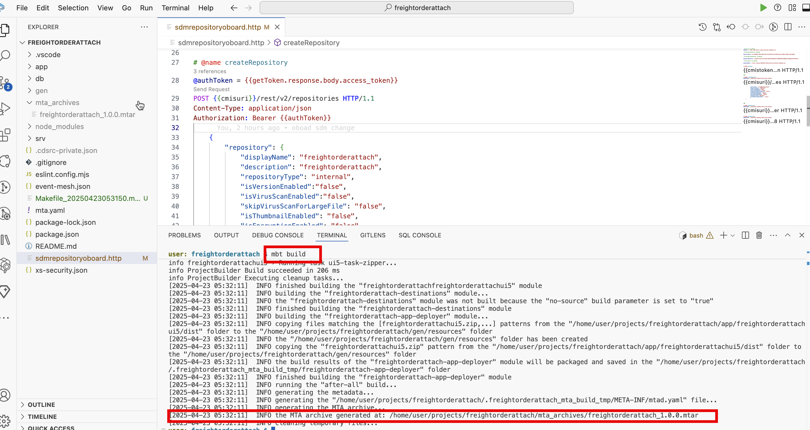

- 4. Run the following commands to login into BTP Cloud Foundry Dev Space in terminal of BAS.

  ```bash
  cf login -a https://api.cf.eu10.hana.ondemand.com
  ```

  You can find the api from your BTP subaccount.

  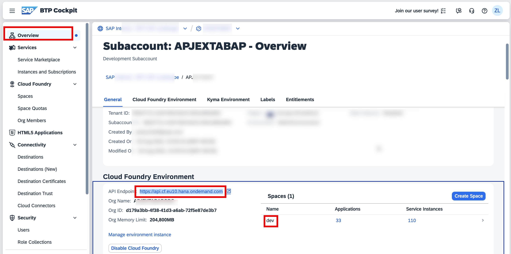

  The following screenshot is the result of the user login.

  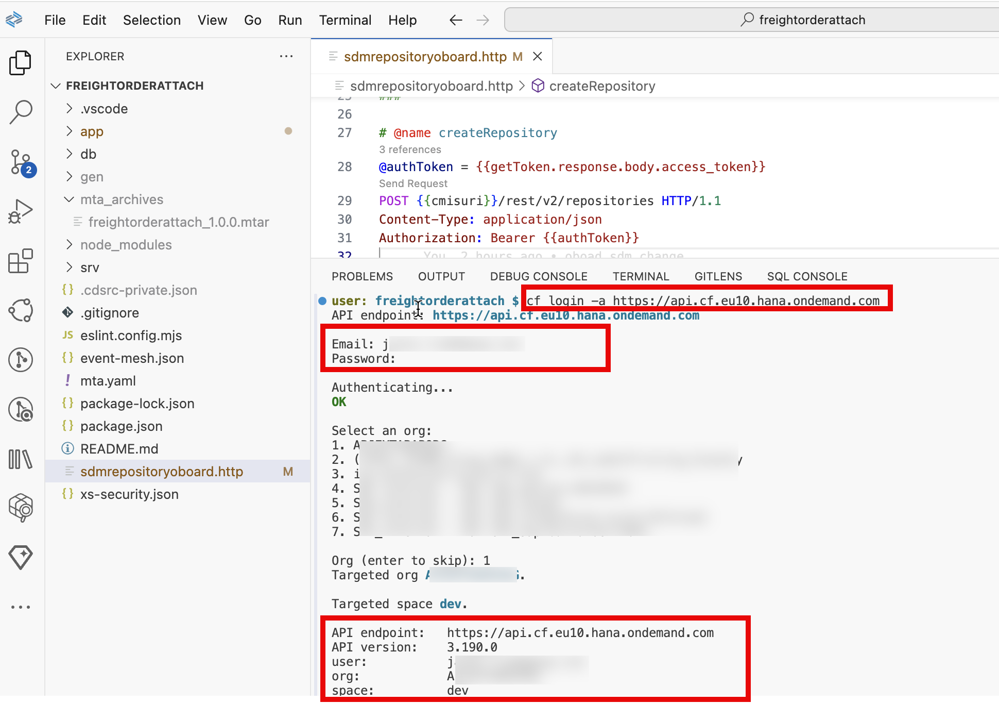

- 5. Deploy the application into BTP Cloud Foundry Runtime in BAS.
     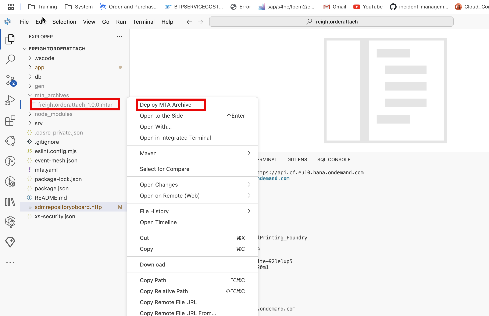
     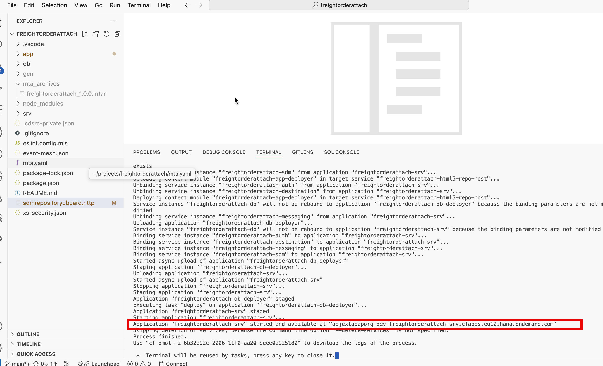
