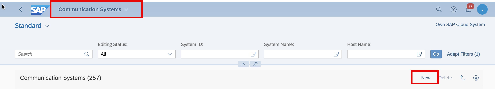
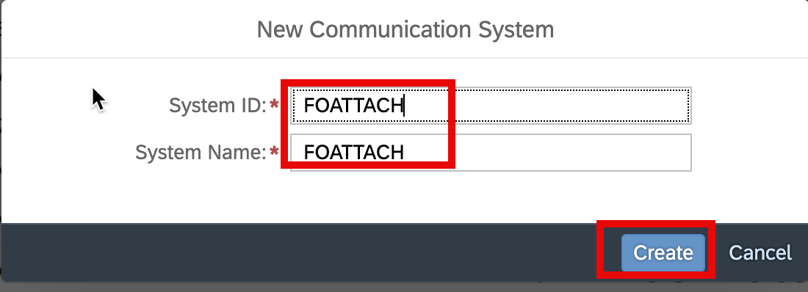

## Overview.

In this card, we will configure the event channel in SAP S/4HANA Cloud to trigger freight order created event sending to BTP Event Mesh. We will also expose Freight order API in SAP S/4HANA Cloud. We will create a destination in BTP subaccount for SAP S/4HANA Cloud.

## Prerequisites:

- Your account as been assigned with role collections **Cloud Connector Administrator** and in BTP subaccount.
- In SAP S/4HANA Cloud, make sure you have the following roles assigned to your user account
  - BR_ADMINISTRATOR oR SAP_BR_ADMINISTRATOR
  - BR_DISPATCHER or SAP_BR_DISPATCHER
  - BR_BPC_EXPERT or SAP_BR_BPC_EXPERT
  - BR_CONF_EXPERT_BUS_NET_INT or SAP_BR_CONF_EXPERT_BUS_NET_INT
    
    
    
    

## Procedure

<details>

<summary>click hear to expand</summary>

- 1. Create service key event mesh instance `freightorderattach-messaging` with following command in BAS terminal and show the service content.

```bash
 cf create-service-key freightorderattach-messaging em-key

 cf service-key freightorderattach-messaging em-key > emkey.json
```


We will use the content of file `emkey.json` to create communication arrangement for communication scenario ID `sap_com_0092` in SAP S/4HANA Cloud.

- 2. In SAP S/4HANA Cloud, Configure communication arrangement in SAP S/4HANA Cloud with communication scenario `SAP_COM_0092` .
     
     

Scenario: SAP_COM_0092

Arrangement Name:ZSAP_COM_0092_FOAT

Communication User: Just click on new to create a new communication user .

Service Key: the content from file `emkey.json` in previous step.


- 3. In SAP S/4HANA Cloud, Configure event channel binding for **freight order created** event.


Input the following value, the click **Create** .

`sap/s4/beh/FreightOrder/Created/v1`


- 4. In SAP S/4HANA Cloud, create communication arrangement to expose the freight order API with Scenario ID SAP_COM_0905.

  - Create communication user

  

  - Create communication system

    
    
    
    

  - Create communication arrangement

    

  - 5. Create destination in BTP subaccount.

    

    Name: `O5PDN`
    Type: `HTTP`
    URL: `<SAP S/4HANA Cloud API URL>`
    User: `<Communication User>`
    Password: `<Communication User Password>`

</details>
