## Overview.

In this card, we will integrate the deployed SAP Fiori Application into SAP Work Zone to make the end user can visit it.

## Prerequisites:

- You have been assigned with the role collection

## Procedure

click hear to expand

- 1. Refresh HTML5 Apps in SAP Work Zone.

  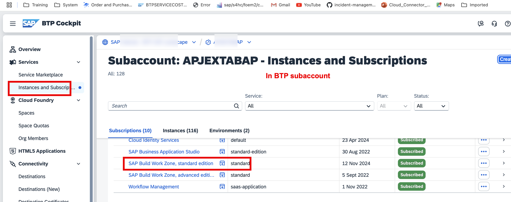
  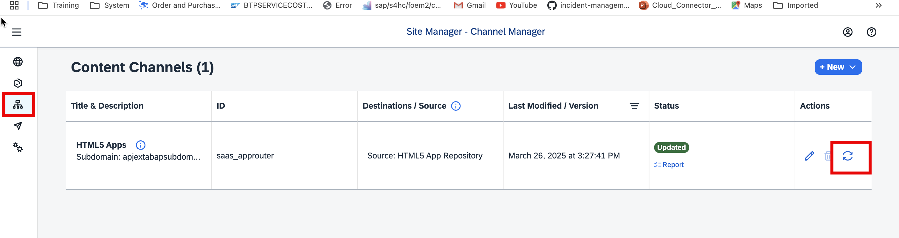

- 2. Add UI5 application from HTML5 Apps in SAP Work Zone.
     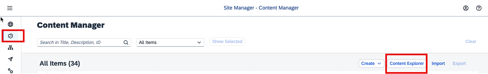
     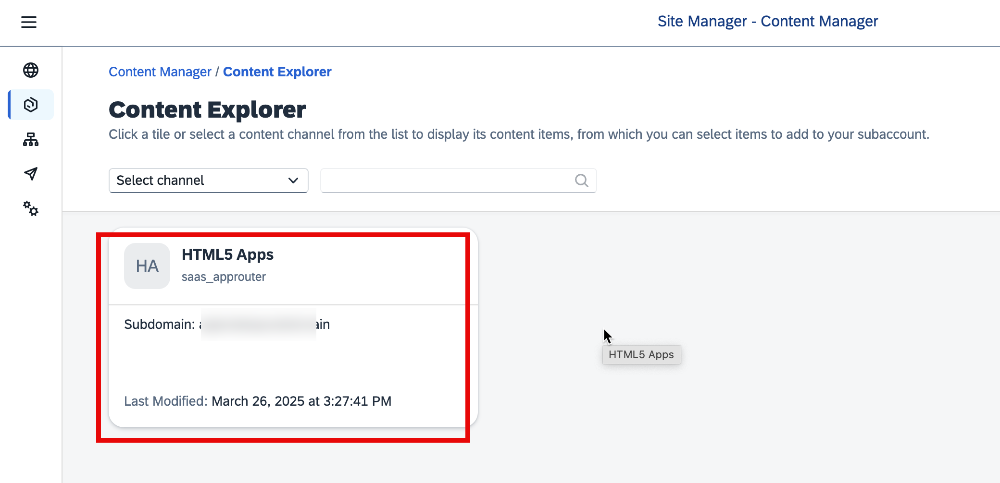
     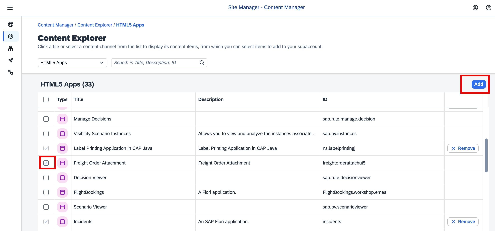

- 3. Create Group in SAP Work Zone.
     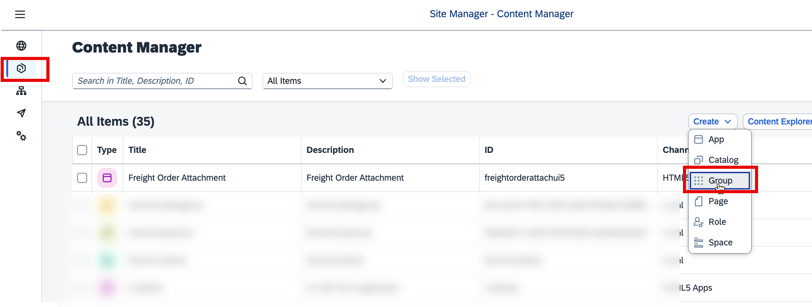
     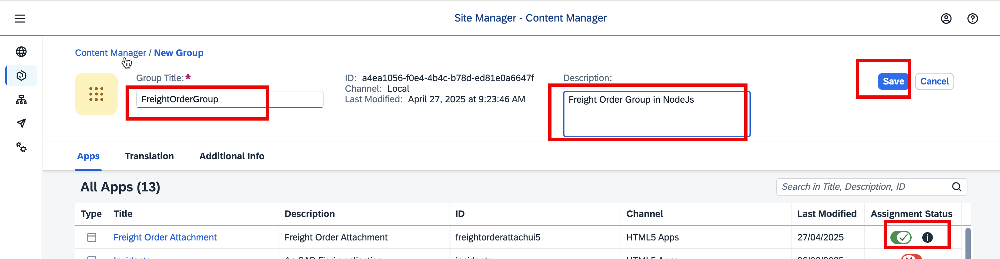

- Group Title: `FreightOrderGroup`
- Description: `Freight Order Group in NodeJs`

- 4. Create Catalog in SAP Work Zone.
     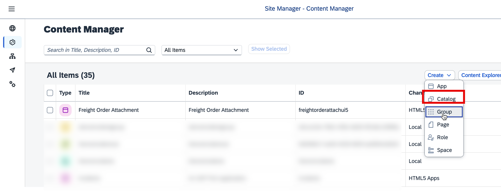
     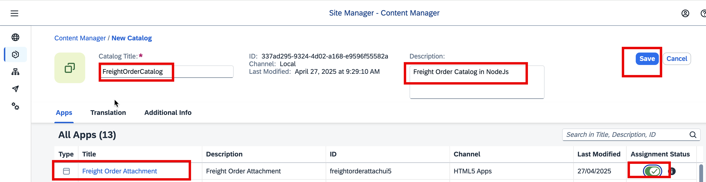

- Catalog Title: `FreightOrderCatalog`
- Description: `Freight Order Catalog in NodeJs`

- 5. Create Role in SAP Work Zone.
     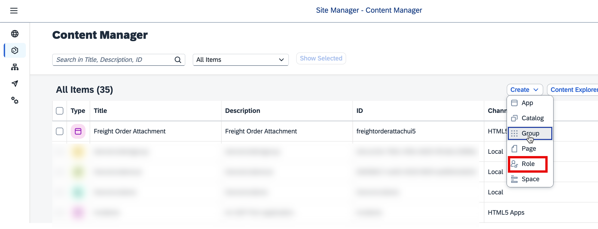
     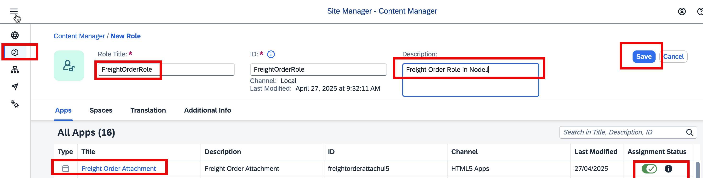

- 6. Create Site in SAP Work Zone.

  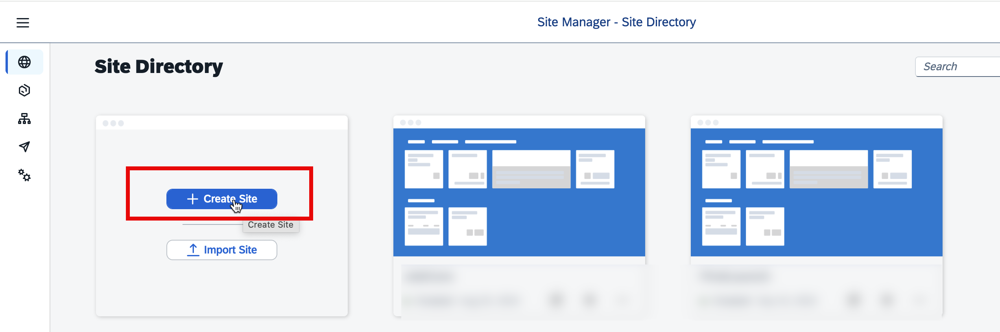
  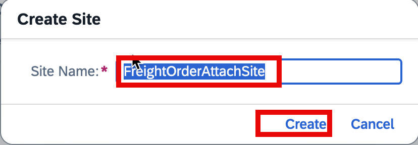

- Site Name: `FreightOrderAttachSite`

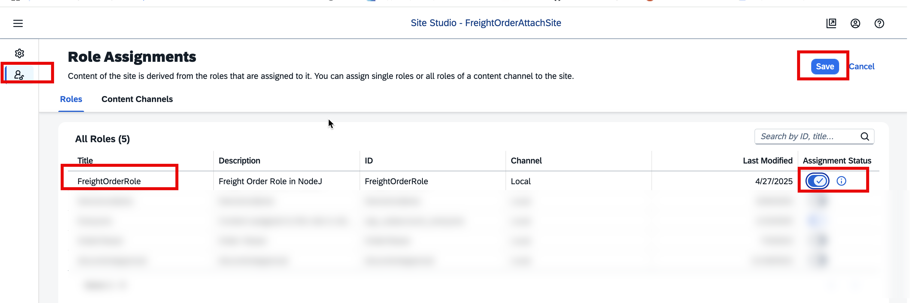

- 7. Assign Role collection in BTP subaccount.
     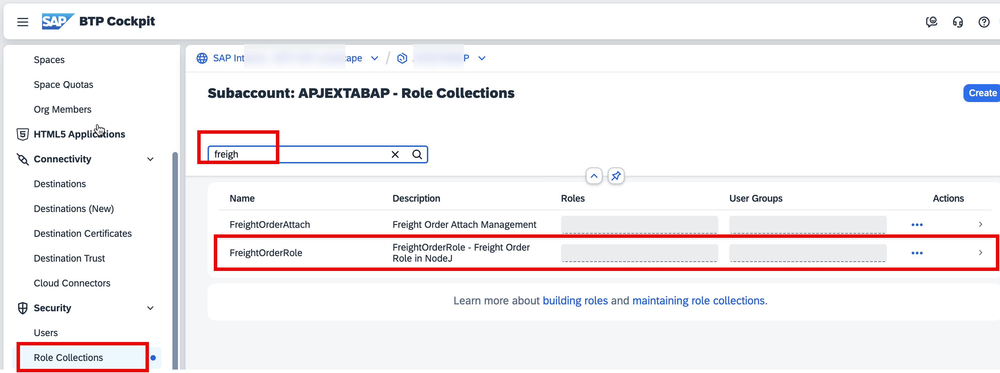
     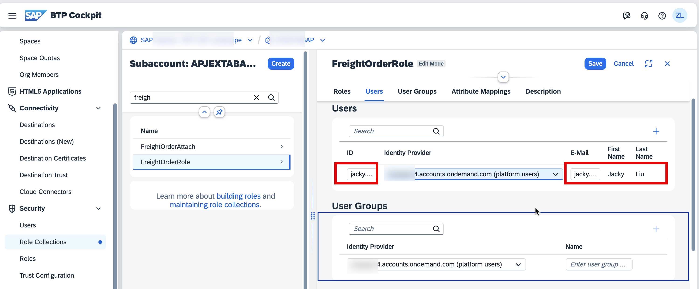

