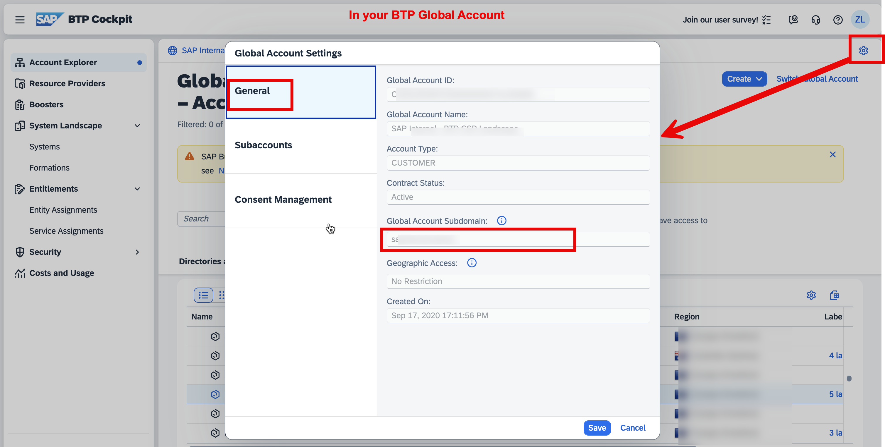
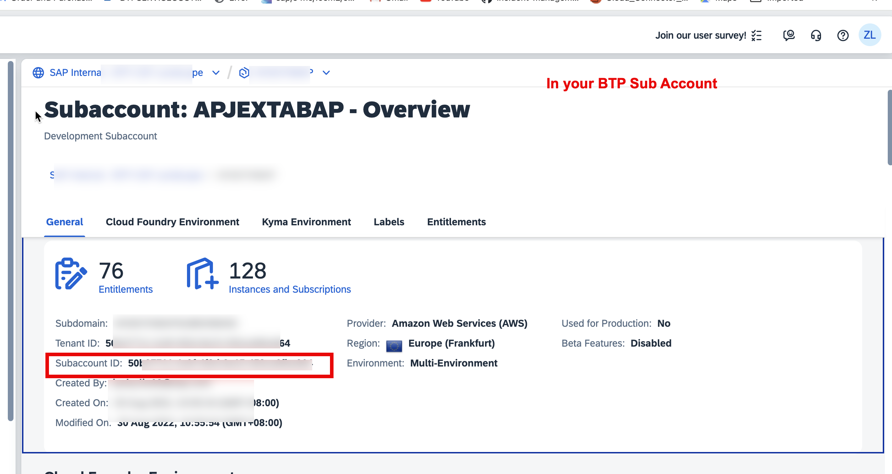
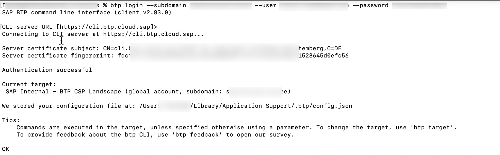
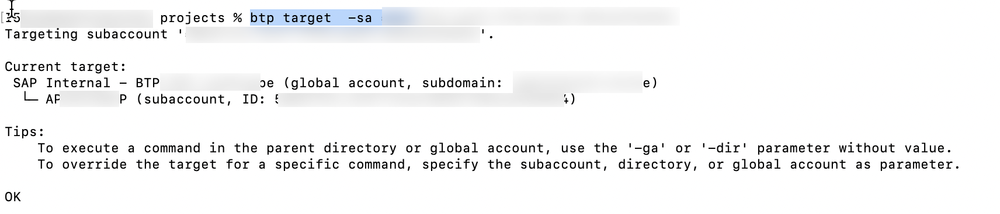
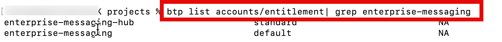
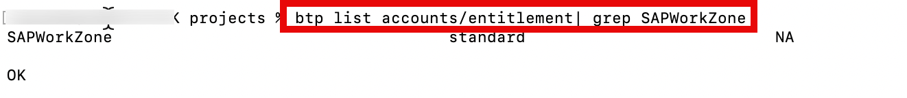
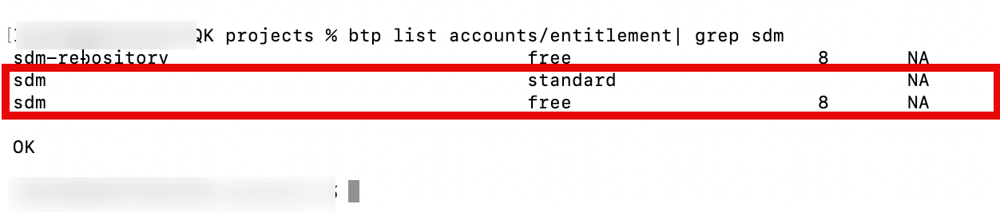
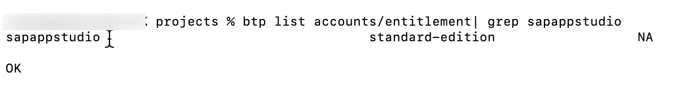
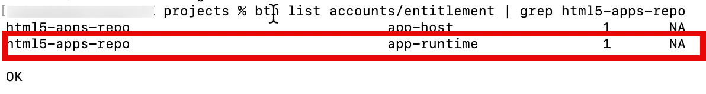

## Overview.

In this card, we will check and assign the required entitlements in the target BTP subaccount.

## Prerequisites:

- You are the BTP Sub Account Administrator
- You have installed btp CLI Command. Please follow [Download and Start Using the btp CLI Client](https://help.sap.com/docs/btp/sap-btp-neo-environment/download-and-start-using-btp-cli-client?locale=en-US).

## Procedure:

- 1. Get you **Global Account Subdomain** and **Subaccount ID** as the following pictures:

  
  

- 2. Log in to a global account of SAP BTP.

  ```bash
  btp login --subdomain <Global Account Subdomain> --user <USER EMAIL> --password <PASSWORD>
  ```

  

- 3. Set the target for commands to a subaccount.

  ```bash
  btp target  -sa <Subaccount ID>
  ```

  

- 4. Check and Assign entitlements of **event mesh** to your BTP subaccount.

  Check your subaccount entitlements from event mesh with the following commands:

  ```bash
  btp list accounts/entitlement| grep enterprise-messaging
  ```

  

  If the results **is blank**, please run the following 2 commands to assign **event mesh** entitlements to the subaccount.

  ```bash
  btp  assign accounts/entitlement --for-service enterprise-messaging --plan default --amount 1

  btp  assign accounts/entitlement --for-service enterprise-messaging-hub --plan standard --amount 1

  ```

- 5. Check and Assign entitlements of **SAP Work Zone Standard** to your BTP subaccount.

  Check your subaccount entitlements from event mesh with the following commands:

  ```bash
  btp list accounts/entitlement| grep SAPWorkZone
  ```

  

  If the results **is blank**, please run the following command to assign **SAP Work Zone Standard** entitlement to the subaccount.

  ```bash
  btp  assign accounts/entitlement --for-service SAPWorkZone --plan standard --amount 1
  ```

- 6. Check and Assign entitlements of **SAP Document Management service, integration option** to your BTP subaccount.

  Check your subaccount entitlements from event mesh with the following commands:

  ```bash
  btp list accounts/entitlement| grep sdm
  ```

  

  If the results **is blank**, please run the following command to assign **SAP Document Management service, integration option** entitlement to the subaccount.

  ```bash
  btp  assign accounts/entitlement --for-service sdm --plan standard --amount 1
  ```

- 7. Check and Assign entitlements of **SAP Business Application Studio** to your BTP subaccount.

  Check your subaccount entitlements from event mesh with the following commands:

  ```bash
  btp list accounts/entitlement | grep sapappstudio
  ```

  

  If the results **is blank**, please run the following command to assign **SAP Business Application Studio** entitlement to the subaccount.

  ```bash
  btp  assign accounts/entitlement --for-service sapappstudio --plan standard-edition --amount 1
  ```

- 8. Check and Assign entitlements of **HTML5 Application Repository Service** to your BTP subaccount.

  Check your subaccount entitlements from event mesh with the following commands:

  ```bash
  btp list accounts/entitlement | grep html5-apps-repo
  ```

  

  If the results **is blank**, please run the following command to assign **HTML5 Application Repository Service** entitlement to the subaccount.

  ```bash
  btp  assign accounts/entitlement --for-service html5-apps-repo --plan app-runtime --amount 1
  ```

- 9. Check and Assign entitlements of **Authorization and Trust Management Service** to your BTP subaccount.

  Check your subaccount entitlements from **Authorization and Trust Management Service** with the following commands:

  ```bash
  btp list accounts/entitlement | grep xsuaa
  ```

  If the results **is blank**, please run the following command to assign **Authorization and Trust Management Service** entitlement to the subaccount.

  ```bash
  btp  assign accounts/entitlement --for-service xsuaa --plan application --amount 1
  ```

- 10. Check and Assign entitlements of **Destination Service** to your BTP subaccount.

  Check your subaccount entitlements from **Destination Service** with the following commands

  ```bash
  btp list accounts/entitlement | grep destination
  ```

  If the results **is blank**, please run the following command to assign **Destination Service** entitlement to the subaccount.

  ```bash
  btp  assign accounts/entitlement --for-service destination --plan lite --amount 1
  ```
