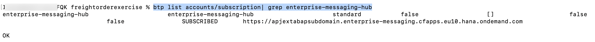

## Overview

In this card, you will subscribe to Event Mesh application and assign the related role collections to your account in BTP subaccount.

## Prerequisites:

- You are the BTP Sub Account Administrator
- You have installed btp CLI Command. Please follow [Download and Start Using the btp CLI Client](https://help.sap.com/docs/btp/sap-btp-neo-environment/download-and-start-using-btp-cli-client?locale=en-US).

## Procedure:

- 1. Get you **Global Account Subdomain** and **Subaccount ID** as the following pictures:
     
     
- 2. Log in to a global account of SAP BTP.

  ```bash
  btp login --subdomain <Global Account Subdomain> --user <USER EMAIL> --password <PASSWORD>
  ```

  

- 3. Set the target for commands to a subaccount.

  ```bash
  btp target  -sa <Subaccount ID>
  ```

  

- 4. Check and create Event Mesh subscription in BTP subaccount with the following command.

  Check your event mesh subscription with the following command.

  ```bash
  btp list accounts/subscription| grep enterprise-messaging-hub
  ```

  
  If the result **is blank**, please create subscription for Event Mesh with the following command:

  ```bash
  btp  subscribe accounts/subaccount --subaccount <Subaccount ID> --to-app enterprise-messaging-hub --plan standard
  ```

- 5. Assign the event mesh role collection to your user account with the following command.

  ```bash
    btp assign security/role-collection "Enterprise Messaging Administrator" --to-user <YOUR EMAIL>

    btp assign security/role-collection "Enterprise Messaging Developer" --to-user <YOUR EMAIL>

    btp assign security/role-collection "Enterprise Messaging Subscription Administrator" --to-user <YOUR EMAIL>

    btp assign security/role-collection "Event Mesh Integration Administrator" --to-user <YOUR EMAIL>

  ```
