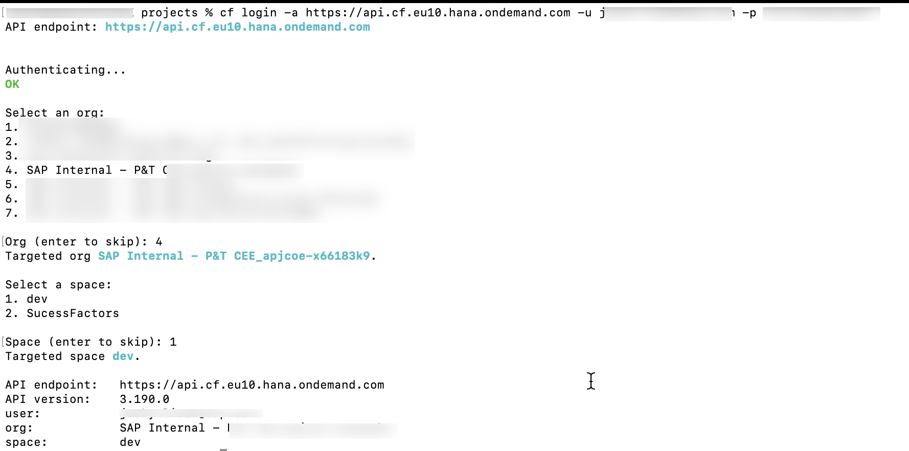
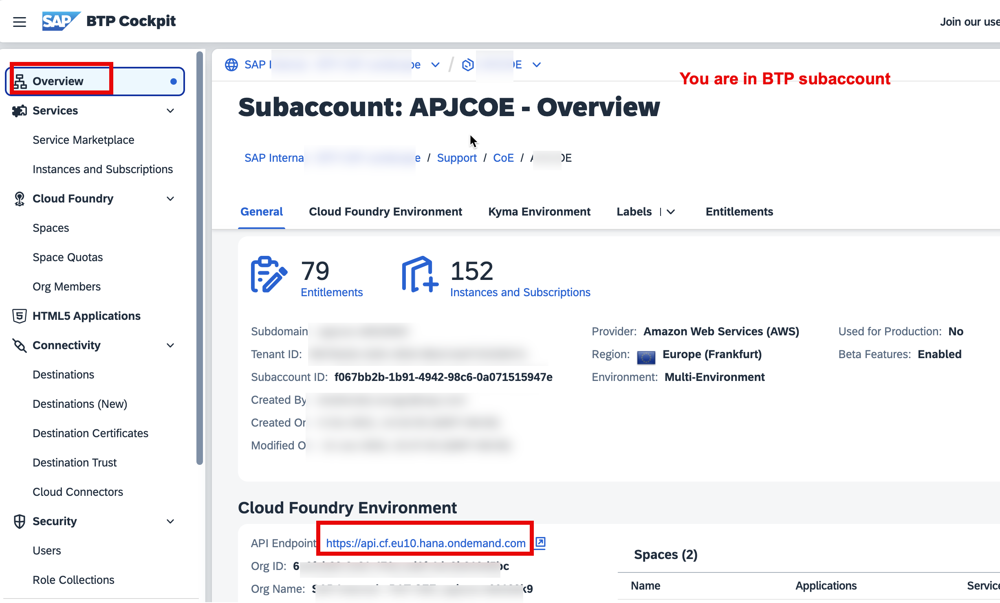
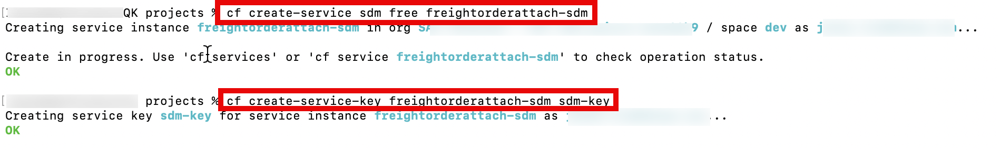
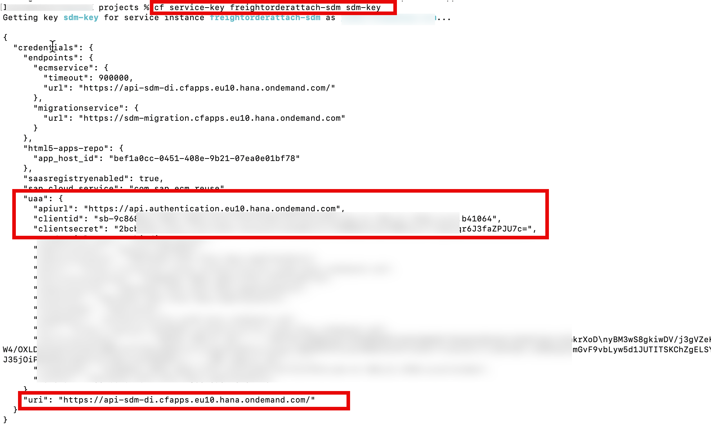
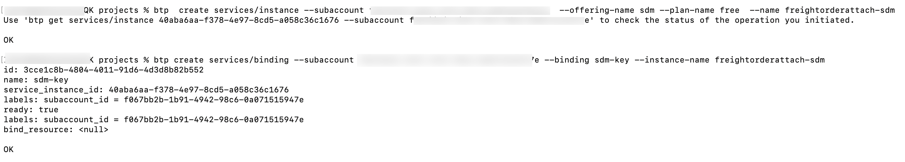
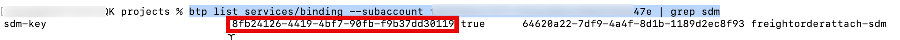
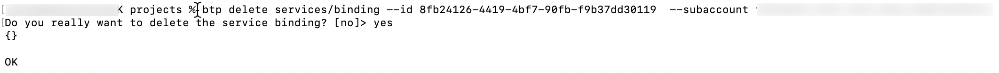
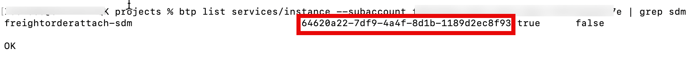
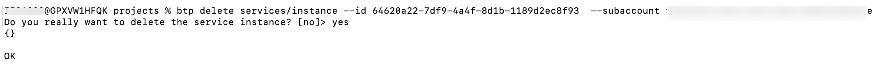

## Overview

In this card, we will create service instance and service key for SAP Document Management, Integration option service. We will use the service key information to on board repository in Business Application Studio.

## Prerequisites:

- You are the BTP Sub Account Administrator and you are Space Developer, Space Manager in Cloud Foundry dev space.
- You have installed The Cloud Foundry Command Line. Please follow [Installing the cf CLI](https://docs.cloudfoundry.org/cf-cli/install-go-cli.html).

## Procedure:

- 1. Login into BTP subaccount cloud foundry with the following commands:

  ```bash
  cf login -a <API_URL> -u <USERNAME> -p <PASSWORD>
  ```

  

  You can get API_URL from the following the screenshot:
  

- 2. Create service instance for SAP Document Management Service and Service key under the service instance with the following commands:

  ```bash

  cf create-service sdm standard freightorderattach-sdm

  cf create-service-key freightorderattach-sdm sdm-key

  ```

  

- 3. Get the Service key content with the following commands, this content will be used for onboarding sdm repository in BAS.

  ```bash
  cf service-key freightorderattach-sdm sdm-key
  ```

  

<!--

```bash
btp  create services/instance --subaccount <subaccount ID>  --offering-name sdm --plan-name standard  --name freightorderattach-sdm

btp create services/binding --subaccount <ID> --binding sdm-key --instance-name freightorderattach-sdm

```



If you want to delete the service binding, please use the following method to delete service binding.

First you need to delete the service binding.

```bash
// get instance binding id
btp list services/binding --subaccount <subaccoun id> | grep sdm
```



```bash
// delete instance binding id
btp delete services/binding --id <instance bind id> --subaccount <subaccoun id> | grep sdm
```



Second you can delete the service instance.

```bash
// get service instance id
btp list services/instance --subaccount <subaccoun id> | grep sdm

```



```bash
// delete service instance id
btp delete services/instance --id <service instance id> --subaccount <subaccoun id> | grep sdm

```



btp list services/binding | grep sdm

btp list accounts/entitlement --subaccount f067bb2b-1b91-4942-98c6-0a071515947e| grep sdm

btp create services/binding --subaccount f067bb2b-1b91-4942-98c6-0a071515947e --binding sdm-key --instance-name freightorderattach-sdm

btp delete services/binding --name freightorderatta-sdm --subaccount f067bb2b-1b91-4942-98c6-0a071515947e

btp create services/binding --subaccount f067bb2b-1b91-4942-98c6-0a071515947e --binding sdm-key --service-instance 59e9fd43-d82c-4b1d-ba3f-84b704ad4de3

btp create services/binding --subaccount f067bb2b-1b91-4942-98c6-0a071515947e --binding sdm-key --instance-name freightorderattach-sdm

btp delete services/instance 59e9fd43-d82c-4b1d-ba3f-84b704ad4de3 --subaccount f067bb2b-1b91-4942-98c6-0a071515947e --confirm false

btp create services/instance --subaccount f067bb2b-1b91-4942-98c6-0a071515947e --offering-name sdm --plan-name standard --name freightorderattach-sdm

btp create services/binding --subaccount f067bb2b-1b91-4942-98c6-0a071515947e --binding sdm-key --instance-name freightorderattach-sdm

btp delete services/binding --subaccount f067bb2b-1b91-4942-98c6-0a071515947e --binding sdm-key --instance-name freightorderattach-sdm
-->
