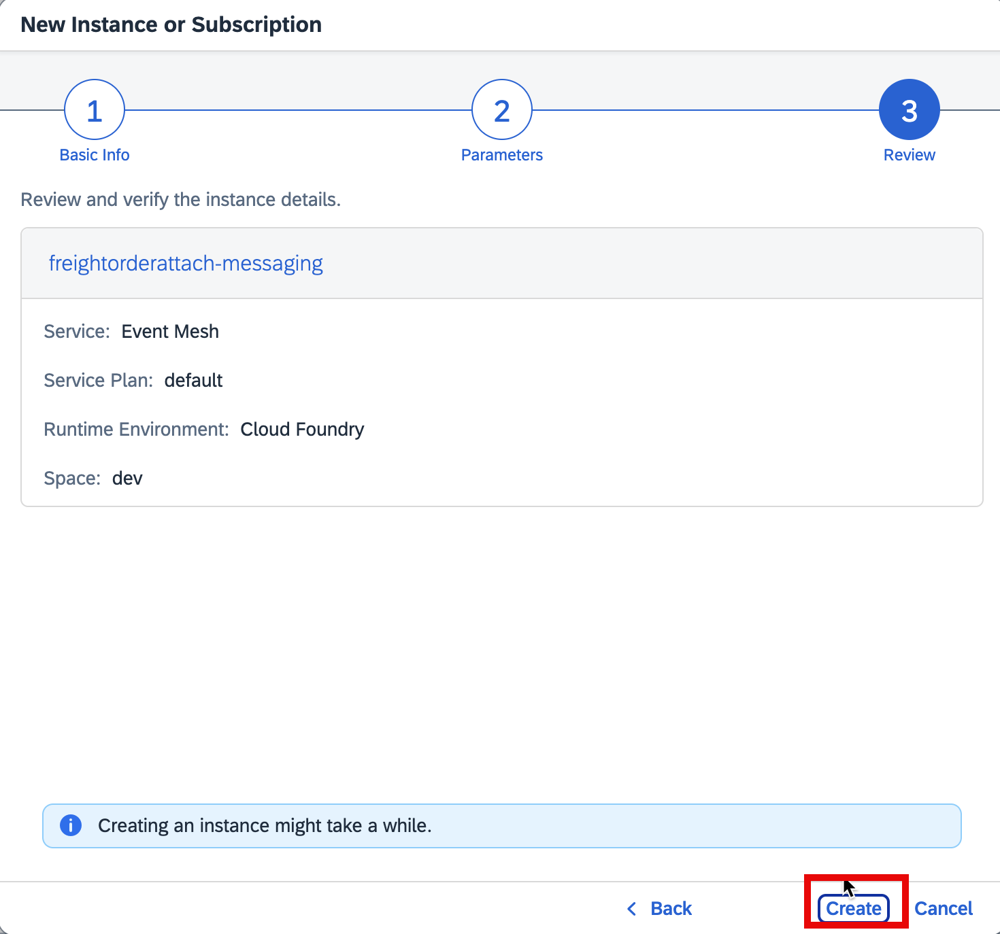
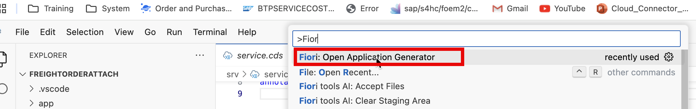
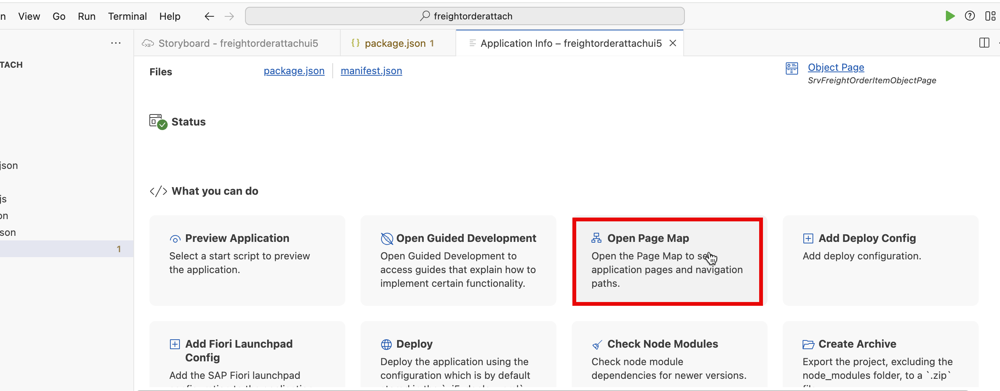

- 1. cds init freightorderattach
- 2. create `schema.cds` under folder `db` with the following code .

```cds
 namespace sap.freightorder.db;

entity DBFreightOrder {
  key TransportationOrderUUID : String(36) ;
  TransportationOrder : String(20) ;
  TransportationOrderType : String(4) ;
  TransportationOrderCategory : String(2) ;
  TransportationShippingType : String(3) ;
  TransportationMode : String(2) ;
  TransportationModeCategory : String(1) ;
  CarrierUUID : String(36);
  Carrier : String(10) ;
  StandardCarrierAlphaCode : String(4) ;
  TranspOrdExecutingCarrierUUID : String(36);
  TranspOrdExecutingCarrier : String(10) ;
  ShipperUUID : String(36);
  Shipper : String(10) ;
  ShipperAddressID : String(40) ;
  ConsigneeUUID : String(36);
  Consignee : String(10) ;
  ConsigneeAddressID : String(40) ;
  TranspPurgOrg : String(8) ;
  TranspPurgOrgExtID : String(20) ;
  TranspPurgGroup : String(8) ;
  TranspPurgGroupExtID : String(20) ;
  PurgOrgCompanyCode : String(4) ;
  CarrierAccountNumber : String(14) ;
  TranspMeansOfTransport : String(10) ;
  TranspOrdPartnerReference : String(35) ;
  TranspOrdResponsiblePerson : String(12) ;
  TranspOrdHasMltplExectgPties : Boolean ;
  TranspOrdInvoicingCarrierLevel : String(2) ;
  TranspOrdLifeCycleStatus : String(2) ;
  TranspOrderSubcontrgSts : String(2) ;
  TransportationOrderConfSts : String(2) ;
  TransportationOrderExecSts : String(2) ;
  TranspOrdGoodsMovementStatus : String(1) ;
  TranspOrdWhseProcessingStatus : String(1) ;
  TranspOrderDngrsGdsSts : String(1) ;
  TranspOrdExecutionIsBlocked : Boolean ;
  TransportationOrderCrtnType : String(2) ;
  CreatedByUser : String(12) ;
  FreightOrderItems: Composition of many  DBFreightOrderItem on FreightOrderItems.TransportationOrderUUID = $self.TransportationOrderUUID;

}


entity DBFreightOrderItem  {


  key TransportationOrderItemUUID : String(36) ;
  TransportationOrderUUID : String(36) ;
  TranspOrdItem : String(10) ;
  TranspOrdItemType : String(4) ;
  TranspOrdItemCategory : String(3) ;
  TranspOrdItemParentItemUUID : String(36) ;
  TranspOrdItemDesc : String(40) ;
  IsMainCargoItem : Boolean ;
  TranspOrdItemSorting : String(6) ;

  SourceStopUUID : String(36);
  DestinationStopUUID : String(36);
  ShipperUUID : String(36);
  Shipper : String(10) ;
  ShipperAddressID : String(40) ;
  ConsigneeUUID : String(36);
  Consignee : String(10) ;
  ConsigneeAddressID : String(40) ;


  FreightUnitUUID : String(36);
  PredecessorTransportationOrder : String(36);
  TranspBaseDocument : String(35) ;
  TranspBaseDocumentType : String(5) ;
  TranspBaseDocumentItem : String(10) ;
  TranspBaseDocumentItemType : String(5) ;
  TransportationEquipmentGroup : String(3) ;
  TransportationEquipmentType : String(10) ;
  TranspEquipmentIsShipperOwned : Boolean ;
  TranspEquipmentPlateNumber : String(20) ;
  TranspEquipRegistrationCountry : String(3) ;
  TranspEquipCapacityLength : Decimal(13, 3) ;
  TranspEquipCapacityWidth : Decimal(13, 3) ;
  TranspEquipCapacityHeight : Decimal(13, 3) ;
  TranspEquipCapacityUnit : String(3) ;
  TranspEquipCapacityWeight : Decimal(31, 14) ;
  TranspEquipCapacityWeightUnit : String(3) ;
  TranspEquipCapacityVolume : Decimal(31, 14) ;
  TranspEquipCapacityVolumeUnit : String(3) ;
  TranspOrdItemPackageID : String(35) ;
  ProductUUID : String(36);
  ProductID : String(18) ;
  MaterialFreightGroup : String(8) ;
  TransportationGroup : String(4) ;
  TranspOrdItmMinTemp : Decimal(7, 2) ;
  TranspOrdItmMaxTemp : Decimal(7, 2) ;
  TranspOrdItemTemperatureUnit : String(3) ;
  TranspOrdItemQuantity : Decimal(31, 14) ;
  TranspOrdItemQuantityUnit : String(3) ;
  TranspOrdItemGrossWeight : Decimal(31, 14) ;
  TranspOrdItemGrossWeightUnit : String(3) ;
  TranspOrdItemGrossVolume : Decimal(31, 14) ;
  TranspOrdItemGrossVolumeUnit : String(3) ;
  TranspOrdItemNetWeight : Decimal(31, 14) ;
  TranspOrdItemNetWeightUnit : String(3) ;
}
```

- 3. Run the following command in path `freightorderattach`

```
npm add @cap-js/sdm
npm add @cap-js/attachments
```

- 4. Create file `attachments.cds` under folder `db`.

```
using { sap.freightorder.db as my  } from './schema';
using { sap.attachments.Attachments } from '@cap-js/sdm';

extend my.DBFreightOrderItem with { attachments: Composition of many Attachments };

```

- 5. Create SDM instance and service key by following [Initial Setup](https://help.sap.com/docs/document-management-service/sap-document-management-service/initial-setup-for-document-management-service-integration-option?locale=en-US).


- 6. Onboarding repository by using tools like postman by using service in Step 5. You can follow [Onboard Repository](https://help.sap.com/docs/document-management-service/sap-document-management-service/onboarding-repository?locale=en-US)
     Note down the repository ID for next step.
     Note it is important to use JSON body as the following content:

```JSON
	{
		"repository": {
			"displayName": "freightorderattach",
			"description": "freightorderattach",
			"repositoryType": "internal",
			"isVersionEnabled":"false",
			"isVirusScanEnabled":"false",
			"skipVirusScanForLargeFile": "false",
			"isThumbnailEnabled": "false",
			"isEncryptionEnabled": "false",
			"isClientCacheEnabled": "false",
			"hashAlgorithms":"SHA-256",
			"isContentBridgeEnabled" : "false" }
	}

```


- 7.  Run the following command in BAS terminal to bind to SDM instance for local testing.

```bash
cds bind -2 freightorderattach-sdm:key

```


- 7. Add the following settings under cds/requires with repository ID from previous. This setting is a different from [CAPire document](https://cap.cloud.sap/docs/plugins/#@cap-js/sdm). I think it will be updated soon.

```JSON
      "sdm": {
          "settings": {
          "repositoryId": "7d59d801-4f40-475a-88ad-8ebe5e094cb1"
   } },

```


- 8. Create folder `external` under folder `srv`
- 9. Download freight order API EDMX file from [Freight Order (A2X)](https://api.sap.com/api/CE_FREIGHTORDER_0001/overview) .
- 10. Move the EDMX file under project folder `external`.
- 11. Run the following command to import the path `freightorderattach`

```
cds import srv/external/CE_FREIGHTORDER_0001.edmx as cds

npm add @sap-cloud-sdk/http-client@3.x @sap-cloud-sdk/connectivity@3.x @sap-cloud-sdk/resilience@3.x
```

- 12. Add messaging by using the following command

```
cds add enterprise-messaging --for  production
cds add enterprise-messaging-shared --for hybrid
```

- 13. Adjust file package.json for the following part.

```json
      "[production]": {
        "messaging": {
          "kind": "enterprise-messaging",
          "publishPrefix": "$namespace/",
          "subscribePrefix": "$namespace/",
          "queue": {
            "name": "$namespace/fo1"
          }
        }
      },
      "[hybrid]": {
        "messaging": {
          "kind": "enterprise-messaging-shared",
          "publishPrefix": "$namespace/",
          "subscribePrefix": "$namespace/"
        }
      }
```

- 14. run the following command to add message library.

```
npm add @sap/xb-msg-amqp-v100
```

- 15. Adjust the file `event-mesh.json' name space as the following:

```
 "namespace": "cap/freightorder/attach"
```

- 16. Create file `service.cds` under folder `srv` with the following content.

```js

using { sap.freightorder.db as db } from '../db/schema';

service freightorder {
    entity SrvFreightOrder  as projection on db.DBFreightOrder ;
    entity SrvFreightOrderItem as projection on db.DBFreightOrderItem;
}


annotate freightorder.SrvFreightOrder with @(requires: 'admin');

annotate freightorder.SrvFreightOrder with  @odata.draft.enabled;

```

- 16. Create file `service.js` under the folder `srv`

```js
const cds = require("@sap/cds");
const LOG = cds.log("service");
module.exports = cds.service.impl(async function () {
  const messaging = await cds.connect.to("messaging");
  const Fo = await cds.connect.to("CE_FREIGHTORDER_0001");
  // const db = cds.connect.to('db');

  messaging.on("ce/sap/s4/beh/FreightOrder/Created/v1", async (msg) => {
    console.log("logic triggered");
    console.log(msg);

    const {
      TransportationOrderUUID,
      TransportationOrder,
      TransportationOrderType,
      TransportationMode,
      TransportationShippingType,
      Carrier,
      TranspPurgOrgExtID,
    } = msg.data;

    console.log(TransportationOrderUUID);

    const { FreightOrder, FreightOrderItem } = Fo.entities;

    const { SrvFreightOrder, SrvFreightOrderItem } = this.entities;

    const freightOrder = await Fo.run(
      SELECT.from(FreightOrder)
        .columns(
          "TransportationOrderUUID",
          "TransportationOrder",
          "TransportationOrderType",
          "TransportationOrderCategory",
          "TransportationShippingType",
          "TransportationMode",
          "TransportationModeCategory",
          "CarrierUUID",
          "Carrier",
          "StandardCarrierAlphaCode",
          "TranspOrdExecutingCarrierUUID",
          "TranspOrdExecutingCarrier",
          "ShipperUUID",
          "Shipper",
          "ShipperAddressID",
          "ConsigneeUUID",
          "Consignee",
          "ConsigneeAddressID",
          "TranspPurgOrg",
          "TranspPurgOrgExtID",
          "TranspPurgGroup",
          "TranspPurgGroupExtID",
          "PurgOrgCompanyCode",
          "CarrierAccountNumber",
          "TranspMeansOfTransport",
          "TranspOrdPartnerReference",
          "TranspOrdResponsiblePerson",
          "TranspOrdHasMltplExectgPties",
          "TranspOrdInvoicingCarrierLevel",
          "TranspOrdLifeCycleStatus",
          "TranspOrderSubcontrgSts",
          "TransportationOrderConfSts",
          "TransportationOrderExecSts",
          "TranspOrdGoodsMovementStatus",
          "TranspOrdWhseProcessingStatus",
          "TranspOrderDngrsGdsSts",
          "TranspOrdExecutionIsBlocked",
          "TransportationOrderCrtnType",
          "CreatedByUser"
        )
        .where({ TransportationOrderUUID: TransportationOrderUUID })
    ).catch((err) => {
      console.log(err);
    });
    const freightOrderItems = await Fo.run(
      SELECT.from(FreightOrderItem).where({
        TransportationOrderUUID: TransportationOrderUUID,
      })
    ).catch((err) => {
      console.log(err);
    });
    const items = Array.isArray(freightOrderItems)
      ? freightOrderItems
      : [freightOrderItems];
    const headers = Array.isArray(freightOrder) ? freightOrder : [freightOrder];

    // console.log("freight order items");
    // console.log(headers);
    // console.log(items);

    await INSERT.into(SrvFreightOrder).entries(headers);
    await INSERT.into(SrvFreightOrderItem).entries(items);
  });
});
```

- 17. Create event mesh instance in BTP Subaccount.

Instance Name: `freightorderattach-messaging`


copy the content of file `event-mesh.json` paste it into next screen.



-15. Create service key for instance `freightorderattach-messaging`

Service Key Name: `freightorderattach-messaging-key`


- 18. Run the following command in BAS terminal.

```
cds bind -2 freightorderattach-messaging:freightorderattach-messaging-key
```

- 19. In SAP S/4HANA Cloud, Configure communication arrangement in SAP S/4HANA Cloud with communication scenario `SAP_COM_0092` .
      
      

Scenario: SAP_COM_0092

Arrangement Name:ZSAP_COM_0092_FOAT

Communication User: Just click on new to create a new communication user .

Service Key: Copy the content of BTP Subaccount service key `freightorderattach-messaging-key`


The following screen is the step of copy service key content.


- 20. In SAP S/4HANA Cloud, Configure event channel binding for **freight order created** event.


Input the following value, the click **Create** .

`sap/s4/beh/FreightOrder/Created/v1`


Copy the following value for next step.

`cap/freightorder/attach/ce/sap/s4/beh/FreightOrder/Created/v1`


- 21. Create Event Q and subscribe the Event Q to topic.
      
      In next screen, input your username and password .
      
      
      
      
      

- 22. Run the application locally with the following command.

```
cds watch --profile hybrid
```


- 23. Create Freight Order In SAP S/4HANA Cloud .
      
      
      
      
      

- 22. The the result in local run application.
      
      

- 24. Generate Fiori application in SAP Business Application Studio.

  
  
  
  
  Data source: `Use a Local CAP Project`

  Choose your CAP project: `freightorderattach`

  OData service: `freightorder (Node.js)`

  Click on **Next**

  

  Main entity : `SrvFreightOrder`

  Navigation entity: `FreightOrderItems`

  Table type: `Responsive`

  Click on **Next**


Module name :`freightorderattachui5`

Application title: `Freight Order Attachment`

Description: `Freight Order Attachment`

Click on **Next**


Semantic Object: `FreightOrder`

Action: `Display`

Title: `Freight Order Attachment`

Click on **Finish**

`View` -> `Command Palette`





Label: `FreightOrderItems`
Value Source: Select `FreightOrderItems`


Label: `ItemDetails`


Label: `Attachments`

Value Source: select `attachments`


- 25. Run the following command in BAS Terminal to preview the application.

```bash
cds watch --profile hybrid
```


Create a freight order in SAP S/4HANA Cloud


Check in application .


- 26. Prepare for deployment and deploy the application to BTP Cloud Foundry.

Using SAP HANA Database

While we used SQLite as a low-cost stand-in during development, we're going to use a managed SAP HANA database for production:

```bash
cds add hana --for production
```

Using XSUAA-Based Authentication

```
cds add xsuaa --for production
```

This will also generate an xs-security.json file

Using MTA-Based Deployment

We'll be using the Cloud MTA Build Tool to execute the deployment. The modules and services are configured in an mta.yaml deployment descriptor file, which we generate with:

```bash
cds add mta
```


SAP Build Work Zone, Standard Edition

For single-tenant applications, you can use [SAP Build Work Zone, Standard Edition](https://discovery-center.cloud.sap/serviceCatalog/sap-build-work-zone-standard-edition)

```bash
cds add workzone
```

Open app/freightorderattachui5/webapp/manifest.json and remove the leading `/` from the uri parameter.


Make additional changes to the mta.yaml file

Update the `freightorderattach-app-deployer` module (path, build-result, and target-path parameters) as follows:


Replace `freightorderattach-attachments` with `freightorderattach-sdm` in `mta.yaml`


Freeze Dependencies

Deployed applications should freeze all their dependencies, including transient ones. Create a package-lock.json file for that:

```bash
npm update --package-lock-only
```


In addition, you need install and freeze dependencies for your UI applications:

```bash
npm i --prefix app/freightorderattachui5
```


Build Deployables with `cds build`

Run cds build to generate additional deployment artifacts and prepare everything for production in a local ./gen folder as a staging area. While cds build is included in the next step mbt build, you can also run it selectively as a test, and to inspect what is generated:

```bash
npm i
cds build --production
```


Assemble with `mbt build`

Now, we use the mbt build tool to assemble everything into a single mta.tar archive:

```bash
mbt build -t gen --mtar mta.tar
```


Deploy to Cloud

Finally, we can deploy the generated archive to Cloud Foundry:

```bash
cf deploy gen/mta.tar
```


- 27. Create role collection and assign user to the role collection in BTP Sub account .


Name: `FreightOrderAttach'
Description: `Freight Order Attach Management`


